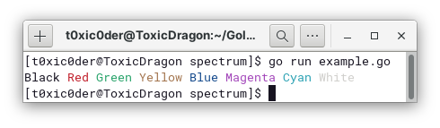
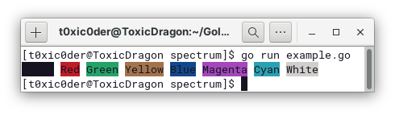
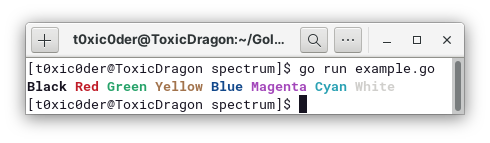
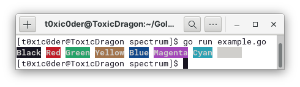

<h1 align="center">spectrum</h1>
<p align="center">No-frills Go package for custom-styled and colored CLI text elements</p>

<p align="center">
    
    
    
    
</p>

## Features
1. Lightweight implementation of ANSI escape sequences to render colors
2. Easy, understandable and mnemonical code to implement styling
3. Cascade multiple styles into one another to get a unique style
4. Actively maintained and updated with issue listings promptly responded to
5. Supports and returns string which can be displayed with STDOUT
6. More colors and advanced styling options would be added down the line

## Usage
- Install the package to your GOPATH by typing in the following in your terminal.
```shell script
$ go get -u github.com/t0xic0der/spectrum
```
- Import the package to your project by typing in the following in your code, after initializing your package.
```go
import "github.com/t0xic0der/spectrum"
```
- Use the following styling and coloring options.
    - **Foreground styling options**
        - Use `spectrum.FR_BLACK("Hello world!")` to return a black-colored string with regular font-face.
        - Use `spectrum.FR_RED("Hello world!")` to return a red-colored string with regular font-face.
        - Use `spectrum.FR_GREEN("Hello world!")` to return a green-colored string with regular font-face.
        - Use `spectrum.FR_YELLOW("Hello world!")` to return a yellow-colored string with regular font-face.
        - Use `spectrum.FR_BLUE("Hello world!")` to return a blue-colored string with regular font-face.
        - Use `spectrum.FR_MAGENTA("Hello world!")` to return a magenta-colored string with regular font-face.
        - Use `spectrum.FR_CYAN("Hello world!")` to return a cyan-colored string with regular font-face.
        - Use `spectrum.FR_WHITE("Hello world!")` to return a white-colored string with regular font-face.
    - **Background styling options**
        - Use `spectrum.BG_BLACK("Hello world!")` to return a string with black-background and regular font-face.                        
        - Use `spectrum.BG_RED("Hello world!")` to return a string with red-background and regular font-face.                        
        - Use `spectrum.BG_GREEN("Hello world!")` to return a string with green-background and regular font-face.                        
        - Use `spectrum.BG_YELLOW("Hello world!")` to return a string with yellow-background and regular font-face.                        
        - Use `spectrum.BG_BLUE("Hello world!")` to return a string with blue-background and regular font-face.                        
        - Use `spectrum.BG_MAGENTA("Hello world!")` to return a string with magenta-background and regular font-face.                        
        - Use `spectrum.BG_CYAN("Hello world!")` to return a string with cyan-background and regular font-face.                        
        - Use `spectrum.BG_WHITE("Hello world!")` to return a string with white-background and regular font-face.                     
    - **Custom styling options**
        - Use `spectrum.TX_BOLD("Hello world!")` to return a string with bold font-face.
        - Use `spectrum.TX_UNDERLINE("Hello world!")` to return a string with underline.
        - Use `spectrum.TX_INVERTED("Hello world!")` to return a string with inverted styling.
- As the functions in `SPECTRUM` take string as an argument and return string as a result - you can cascade them to obtain over 360 distinct combinations as a result..
- Read the examples provided in the next section to know more about how you can cascade functions.

## Examples
Because one example speaks a thousand words.

### Rendering CLI text with only foreground colors

#### SYNTAX
```go
package main

import (
	"fmt"
	"github.com/t0xic0der/spectrum"
)

func main() {
	fmt.Println(spectrum.FR_BLACK("Black") + " " +
		spectrum.FR_RED("Red") + " " + 
		spectrum.FR_GREEN("Green") + " " + 
		spectrum.FR_YELLOW("Yellow") + " " + 
		spectrum.FR_BLUE("Blue") + " " + 
		spectrum.FR_MAGENTA("Magenta") + " " + 
		spectrum.FR_CYAN("Cyan") + " " + 
		spectrum.FR_WHITE("White"))
}
```

#### OUTPUT


### Rendering CLI text with only background colors

#### SYNTAX
```go
package main

import (
	"fmt"
	"github.com/t0xic0der/spectrum"
)

func main() {
	fmt.Println(spectrum.BG_BLACK("Black") + " " +
		spectrum.BG_RED("Red") + " " + 
		spectrum.BG_GREEN("Green") + " " + 
		spectrum.BG_YELLOW("Yellow") + " " + 
		spectrum.BG_BLUE("Blue") + " " + 
		spectrum.BG_MAGENTA("Magenta") + " " + 
		spectrum.BG_CYAN("Cyan") + " " + 
		spectrum.BG_WHITE("White"))
}
```

#### OUTPUT


### Rendering bold CLI text with varied colors

#### SYNTAX
```go
package main

import (
	"fmt"
	"github.com/t0xic0der/spectrum"
)

func main() {
	fmt.Println(spectrum.FR_BLACK(spectrum.TX_BOLD("Black")) + " " +
		spectrum.FR_RED(spectrum.TX_BOLD("Red")) + " " +
		spectrum.FR_GREEN(spectrum.TX_BOLD("Green")) + " " +
		spectrum.FR_YELLOW(spectrum.TX_BOLD("Yellow")) + " " +
		spectrum.FR_BLUE(spectrum.TX_BOLD("Blue")) + " " +
		spectrum.FR_MAGENTA(spectrum.TX_BOLD("Magenta")) + " " +
		spectrum.FR_CYAN(spectrum.TX_BOLD("Cyan")) + " " +
		spectrum.FR_WHITE(spectrum.TX_BOLD("White")))
}
```

#### OUTPUT


### Rendering bold CLI text with white foreground color and varied background colors

#### SYNTAX
```go
package main

import (
	"fmt"
	"github.com/t0xic0der/spectrum"
)

func main() {
	fmt.Println(spectrum.BG_BLACK(spectrum.TX_BOLD(spectrum.FR_WHITE("Black"))) + " " +
		spectrum.BG_RED(spectrum.TX_BOLD(spectrum.FR_WHITE("Red"))) + " " +
		spectrum.BG_GREEN(spectrum.TX_BOLD(spectrum.FR_WHITE("Green"))) + " " +
		spectrum.BG_YELLOW(spectrum.TX_BOLD(spectrum.FR_WHITE("Yellow"))) + " " +
		spectrum.BG_BLUE(spectrum.TX_BOLD(spectrum.FR_WHITE("Blue"))) + " " +
		spectrum.BG_MAGENTA(spectrum.TX_BOLD(spectrum.FR_WHITE("Magenta"))) + " " +
		spectrum.BG_CYAN(spectrum.TX_BOLD(spectrum.FR_WHITE("Cyan"))) + " " +
		spectrum.BG_WHITE(spectrum.TX_BOLD(spectrum.FR_WHITE("White"))))
}
```

#### OUTPUT


## Disclaimer
<p align="justify">Spectrum is steadfastly growing. When you use this package, you agree to not hold its contributors responsible for any damages there may occur due to the use of this package. You agree that you are aware of the experimental condition of Spectrum and that you would want to use it at your own risk.</p>

## Contribute
<p align="justify">You may request for the addition of new features in the issues page but as the project is singlehandedly maintained - it might take time to develop on them. Please consider forking the repository and contributing to its development. :heart: </p>